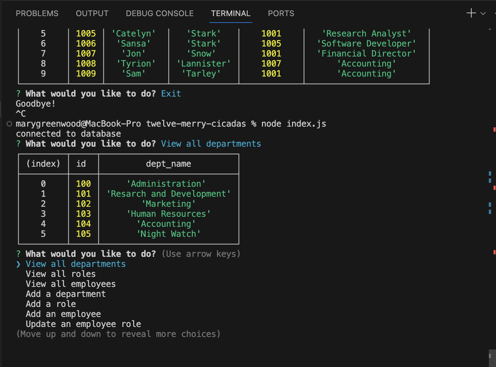

# Employee Database Manager

## Description

Uses command-line to interface with preformatted Employee Database. CRUD functions allow user to view departments, view roles, view employees, add a department, add a role or add or update an employee.

## Table of Contents

- [Installation](#installation)
- [Usage](#usage)
- [Contributing](#contributing)
- [Tests](#tests)
- [License](#license)
- [Questions](#questions)

## Installation

Download code and create dotenv file to store mysql user information. In command line, run npm install , then log into mysql to create and seed (optional) database. Quit mysql and run "node index.js" to launch program. Click [here](https://drive.google.com/file/d/1X9QJ7eekF5wo0WZAAmsI6cWRwUEikiOi/view) to view demo of application use.

## Usage

N/A

## Contributing

N/A

## Tests

N/A

## License

This project is licensed under the MIT license.
https://opensource.org/licenses/MIT

## Questions

Github: https://github.com/marysgreenwood
Email: N/A
